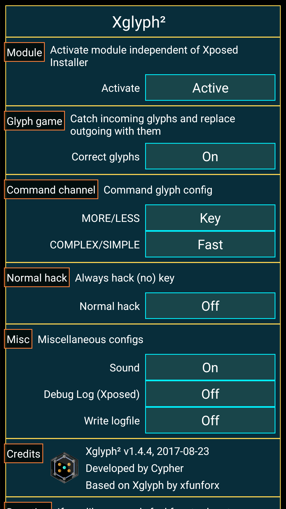

# Xglyph²

Xglyph² is an <a href="http://repo.xposed.info/">Xposed</a> module, that's adding some mods to the glyph game in Niantic's augmented reality game <a href="https://play.google.com/store/apps/details?id=com.nianticproject.ingress">Ingress</a>.

It let's you
* correct glyphs by replacing outgoing glyphs with incoming ones
* automatically send MORE/LESS command glyphs to request a/no key
* automatically send COMPLEX/SIMPLE command glyphs to display glyphs faster/slower

As a kind of bonus, it also let's you
* request no key when hacking normal, not playing the glyph game

CAUTION!!
THIS IS DEFINITLY AGAINST THE INGRESS TOS! EVEN THOUGH IT'S VERY UNLIKELY, THAT USAGE OF THIS MODULE IS DETECTED, I'M NOT RESPONSIBLE FOR BANS!

The module is based on the original <a href="https://github.com/xfunforx/IngressXglyph">Ingress Xglyph</a>, developed by xfunforx and me, but with a much nicer interface, imitating the interface of Ingress.

The module should work for all versions of Ingress, but as you have to use the newest Ingress app anyway, backward compatibility doesn't matter.

The interface should be self explaining, but there are also description dialogs, just tap the orange section headers.

Xposed is also used to hide the module itself from the Ingress client app. As far as we know, Ingress isn't searching for Xglyph particularly, but it's better to be prepared.

